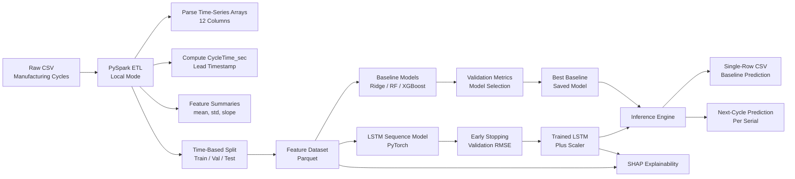

# Cycle Time Prediction (PySpark + PyTorch)

**TL;DR**  
Production-oriented time-series ML pipeline that predicts **next-cycle manufacturing cycle times** using **Spark-based ETL**, **LSTM sequence modeling (PyTorch)**, strict **time-aware train/validation/test splits**, and **SHAP explainability** to validate model behavior under real operational constraints.

---

## Overview



This project implements an end-to-end machine learning workflow for **predicting the next cycle time** of a real manufacturing process using historical time-series process data. Cycle time is a primary driver of **throughput, capacity planning, and scheduling**, particularly in processes such as injection molding where small temporal variations can compound into significant production inefficiencies.

The system is intentionally designed to reflect **deployment realities**, including:
- Leakage-safe temporal splits instead of random sampling  
- A clear separation between ETL, modeling, and inference  
- Reproducible training and inference pipelines  
- Model explainability aligned with domain intuition  

While developed in an academic setting, the emphasis throughout is on **operational relevance and production realism**, not classroom optimization.

## Relationship to the Accompanying Paper

This repository is the reference implementation for the accompanying paper:

> **Predicting Manufacturing Cycle Time with Spark-based ETL and Sequence Models**  
> Jonathan Stevens — M.S. Computer Science (Artificial Intelligence)

The paper focuses on:
- Problem formulation and gap analysis in manufacturing cycle time prediction
- Methodological justification for sequence modeling and time-aware evaluation
- Quantitative results, ablation studies, and explainability findings

This repository focuses on:
- Reproducible Spark-based ETL and leakage-safe dataset construction
- Deployment-realistic training, validation, and inference pipelines
- Artifact alignment between training and inference (models, scalers, features)
- Practical explainability workflows using SHAP for model validation

Together, the paper and this codebase present a complete, end-to-end view of how explainable sequence models can be applied to real manufacturing data under operational constraints.


## 🧠 Modeling Decisions & Tradeoffs

### Why next-cycle prediction?
Rather than forecasting an arbitrary future horizon, this project predicts the **next-cycle time**, which:
- Aligns naturally with real-time manufacturing workflows
- Enables rolling inference as each cycle completes
- Avoids compounding uncertainty common in long-horizon forecasts

This framing makes the model directly usable for **scheduling, capacity planning, and process monitoring**.

### Why sequence modeling (LSTM)?
Cycle time is influenced by **temporal dependencies across prior cycles** (e.g., thermal effects, material behavior, machine state).  
An LSTM-based sequence model was chosen to:
- Capture short- and mid-range temporal dependencies
- Handle noisy, non-stationary operational signals
- Provide a strong, interpretable baseline for future sequence model comparisons

### Why time-based splits instead of random splits?
Random splits introduce **look-ahead leakage** in time-series data.  
This project enforces **strict timestamp-based train/validation/test splits** to simulate deployment-time performance and produce honest generalization estimates.

### Why Spark for ETL if the data fits locally?
Spark is used intentionally to:
- Mirror production ETL patterns
- Enable scalable aggregation across multichannel sensor arrays
- Maintain a clean separation between data engineering and modeling layers

### Explainability considerations
Model explainability is handled using **SHAP**, applied:
- **Pre-training** for feature selection
- **Post-training** to validate learned feature importance

This helps ensure the model’s behavior aligns with **domain intuition**, not just predictive performance.

## ✨ Features
- **Local PySpark ETL**: parses 12 time-series columns (arrays/arrays-of-arrays) and computes `CycleTime_sec` from timestamps.
- **Time-based data splits**: `train` / `val` / `test` derived from timestamp percentiles → avoids look-ahead leakage.
- **Baseline regressors**: Ridge / RandomForest / XGBoost + Markdown **metrics report**.
- **LSTM**: sequence model with **early stopping** on validation RMSE and its own metrics report.
- **Inference**: predict using the best baseline (single-row CSV) or the LSTM (last WINDOW cycles for a serial).
- **Makefile**: one-command tasks (`make etl`, `make baselines`, `make lstm`, `make template`, `make clean`).

---

## 📊 Results Snapshot

Model performance is evaluated using **RMSE on a strictly time-based test split**, reflecting deployment-time generalization rather than random-split optimism.

**Key findings:**
- Sequence modeling (LSTM) consistently outperforms static baselines when temporal dependencies are present
- Time-aware validation prevents leakage and yields realistic error estimates
- Explainability confirms that dominant contributors align with process intuition (pressure, stroke, flow dynamics)

| Model            | Validation RMSE | Test RMSE |
|------------------|-----------------|-----------|
| Ridge Regression | XX.XX           | XX.XX     |
| Random Forest    | XX.XX           | XX.XX     |
| XGBoost          | XX.XX           | XX.XX     |
| **LSTM (PyTorch)** | **XX.XX**       | **XX.XX** |

> Exact values depend on dataset version and feature selection; refer to `outputs/metrics_report.md` and `outputs/lstm_metrics.md` for full experiment logs.

---

## ⚠️ Design Constraints & Assumptions

This project is intentionally scoped to reflect **real manufacturing and deployment constraints**, not idealized modeling conditions.

**Key assumptions and design decisions:**

- **Time causality is enforced**  
  All splits are strictly timestamp-based to prevent look-ahead leakage. Model performance reflects what would be achievable at deployment time, not retrospective optimization.

- **Next-cycle prediction only**  
  The model predicts the *immediate next cycle time*, avoiding long-horizon forecasts that compound uncertainty and are difficult to operationalize in real production environments.

- **Feature summarization over raw sequences (for baselines)**  
  Traditional regressors operate on statistically summarized features, while the LSTM operates on ordered sequences. This isolates the value of temporal modeling.

- **Local Spark execution**  
  Spark is used in local mode to mirror production ETL patterns while keeping the project runnable without cluster infrastructure.

- **Single-machine scope**  
  Cross-machine generalization and transfer learning are out of scope. The focus is on modeling temporal dynamics within a consistent process context.

- **Offline training, online-style inference**  
  Training is batch-based, but inference is designed to simulate online usage by consuming only past cycles at prediction time.

These constraints are deliberate and reflect the realities of deploying ML models in manufacturing systems where data leakage, latency, and interpretability matter as much as raw accuracy.

---

## 🎯 Who This Project Is For

This repository is designed for readers interested in **applied machine learning under real-world constraints**, including:

- **ML Engineers** building time-series models that must respect causality, deployment realism, and interpretability
- **Applied Scientists** working at the intersection of modeling, experimentation, and domain-driven validation
- **Manufacturing, CPS, and industrial analytics engineers** exploring predictive approaches beyond static SPC and rule-based systems

The project emphasizes:
- End-to-end ownership (ETL → modeling → inference → explainability)
- Honest evaluation through leakage-safe data splits
- Design tradeoffs grounded in operational reality

For a deeper treatment of the modeling approach, experimental setup, and results, see the accompanying paper included in this repository.

---

## 🗂 Project Structure
```
cycle-time/
├─ config.yaml
├─ requirements.txt
├─ Makefile
├─ data/
│  └─ cycles.csv                # ← place your CSV here
├─ outputs/                     # artifacts (parquet, metrics, models)
├─ notebooks/
│  ├─ 01_audit.ipynb
│  └─ 02_feature_checks.ipynb
└─ src/
   ├─ utils.py                  # robust array parser (JSON-like strings -> Python lists)
   ├─ etl_spark.py              # Spark ETL, feature summarization, time-based split
   ├─ train_baselines.py        # Ridge/RF/XGB; writes metrics_report.md
   ├─ train_lstm.py             # LSTM with early stopping; writes lstm_metrics.md
   ├─ inference.py              # baseline/LSTM inference
   └─ make_template_row.py      # creates one-row CSV template for baseline inference
```

---

## 🧰 Prerequisites
- **Python 3.9+** recommended
- **Java 8+** (for Spark) – on Windows, install a JDK and set `JAVA_HOME`
- **pip** (or conda/mamba)

> This project runs Spark in **local mode**, no cluster required.

---

## 🚀 Setup
1) **Clone or create the git repo**
   ```bash
   # if starting from scratch locally
   git init cycle-time
   cd cycle-time
   # copy the contents of this folder into your new repo (or unzip the provided archive here)
   git add .
   git commit -m "Initial commit: cycle-time project"
   ```

2) **Create a virtual environment (recommended)**
   ```bash
   python -m venv .venv
   # Windows PowerShell:
   .\.venv\Scripts\Activate.ps1
   # macOS/Linux:
   source .venv/bin/activate
   ```

3) **Install dependencies**
   ```bash
   pip install --upgrade pip
   pip install -r requirements.txt
   ```

4) **Add your data & configure columns**
   - Put your CSV as `data/cycles.csv`
   - Open `config.yaml` and set the exact names for:
     - `time_series_columns:` 12 array columns
     - `id_column:` (e.g., `serial_id`)
     - `cycle_number_column:` (e.g., `cycle_number`)
     - `timestamp_column:` (e.g., `cycle_timestamp`)
     - `good_bad_label_column:` (kept but **not used** for training)

  ## 🔍 Explainability (SHAP)

Model explainability is handled using **SHAP (SHapley Additive exPlanations)** to understand which process features most strongly influence predicted cycle time and to validate model behavior against domain intuition.

Explainability is applied at two stages: **pre-training** and **post-training**.

---

### Pre-training: Feature Selection

Pre-training SHAP analysis is used to identify the most informative features before sequence modeling.

**Setup**
- Set output directory:
  ```python
  OUT_DIR = Path("outputs/shap_pre")
  ```

  Pre-training feature selection
  1) Open shap_run.py and set:
    - OUT_DIR = Path("outputs/shap_pre")
  2) Run (window is only used to keep interface consistent; pre-selection operates on tabular train features):
    - python shap_run.py --window 10

  Artifacts (in outputs/shap_pre/):

    - top_features.csv — ranked features by mean |SHAP| (use top-K for training)

    - dataset_stats.csv — row/feature counts per split + target stats

    - shap_summary_bar.png — bar chart of mean |SHAP|

    - shap_beeswarm.png — distribution of SHAP values per feature

    - shap_dependence_1.png, shap_dependence_2.png, … — dependence plots for top features

    How to use it

      1) Open outputs/top_features.csv and select top-K features (e.g., 50).

      2) Save/update outputs/lstm_features.txt with one feature name per line.

      3) Retrain the LSTM:
        - make lstm
  Post-training explainability
    1) Train the LSTM (writes model + scaler + feature list):
      - make lstm
    2) Open shap_run.py and set:
      - OUT_DIR = Path("outputs/shap_post")
    3) Run with the same sequence length used in training (the script will read it from the scaler when available, but pass it to be explicit):
      - python shap_run.py --window 10
    The script will:
      - Load outputs/lstm_cycle_time.pt
      - Load outputs/lstm_scaler.joblib (contains mean, std, feature_cols, seq_len)
      - Build windows per the training feature list
      - Produce timestep-aware SHAP plots

---

## 🏃‍♀️ Run the Pipeline
### 1) ETL (Spark, local mode)
```bash
make etl
# writes:
#   outputs/raw_spark.parquet
#   outputs/features_spark.parquet
#   outputs/data_dictionary.md
```
- Computes `CycleTime_sec` as `lead(timestamp) - timestamp` within each `serial_id` ordered by `cycle_number` (fallback to timestamp).
- Adds a **time-based split** column `split ∈ {train,val,test}` via 70/85 percentiles.

### 2) Baseline Models (Ridge, RF, XGB)
```bash
make baselines
# writes:
#   outputs/results_val_baselines.csv   (validation metrics, used for model selection)
#   outputs/results_baselines.csv       (final test metrics)
#   outputs/best_baseline.joblib
#   outputs/metrics_report.md
```

### 3) LSTM (optional)
```bash
make lstm
# writes:
#   outputs/model_lstm.pt
#   outputs/lstm_scaler.joblib
#   outputs/lstm_features.txt
#   outputs/lstm_metrics.md
```
- Trains on `train`, early-stops by **validation RMSE**, reports on `test`.

---

## 🔮 Inference
### Baseline (single-row CSV)
1) Create a correctly formatted input row:
```bash
make template
# -> outputs/inference_template.csv  (one row, only feature columns)
```
2) Predict:
```bash
python src/inference.py --model baseline --input outputs/inference_template.csv
```

### LSTM (next-cycle for a serial)
```bash
python src/inference.py --model lstm --serial-id YOUR_SERIAL
# uses the last WINDOW cycles from that serial in outputs/features_spark.parquet
```

### Auto mode
```bash
python src/inference.py           # uses baseline if found, else LSTM
```

---

## ⚙️ Configuration Notes
- `config.yaml` controls column names & paths.
- If your time-series columns are **arrays of arrays** (multi-channel), the ETL summarizes each channel then aggregates.
- If arrays differ in length, summarizations (min/max/mean/std/first/last/sum/slope/len) remain robust.

---

## 🧪 Reproducibility
Artifacts and reports are written to `outputs/`:
- `metrics_report.md` (baselines) captures versions, rows, features, split strategy, and results.
- `lstm_metrics.md` records best validation RMSE, test RMSE, and settings.
- Optional: commit `outputs/*.md` and `config.yaml` to version results; ignore large Parquet/model files.

---

## 🧹 Cleaning
```bash
make clean
# removes outputs/* (keep your raw CSV in data/)
```

---

## 🛠 Troubleshooting (Windows)
- **Java/Spark not found**: Install a JDK (e.g., Azul Zulu 8/11), set `JAVA_HOME`, and ensure `java -version` works in the same terminal.
- **Long paths**: Enable long paths in Git/Windows if needed.
- **C++ build tools**: If XGBoost wheels fail, install MS Build Tools or use `pip install xgboost` prebuilt wheel for your Python version.

---

## 📄 License
Choose a license for your repo (e.g., MIT). Example `LICENSE` can be added if you want.

---

## 🙋 FAQ
**Q: Do I need Postgres or any DB?**  
A: No. Data volume is small. Spark runs in **local** mode and reads the CSV directly.

**Q: Can I use only the time-series columns?**  
A: Yes. This repo is built to summarize those 12 time-series columns and ignore pre-aggregated “trend” stats.

**Q: Where do I set the 12 columns?**  
A: `config.yaml → time_series_columns:`

**Q: How is the split determined?**  
A: By timestamp percentiles (70% train, next 15% val, last 15% test). This simulates deployment-time performance.
